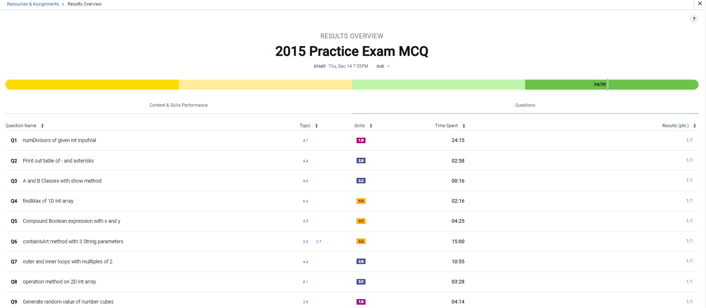
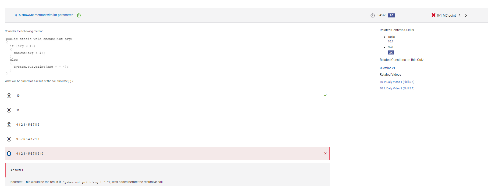
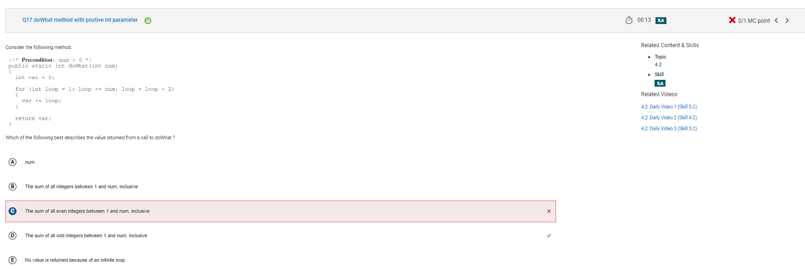
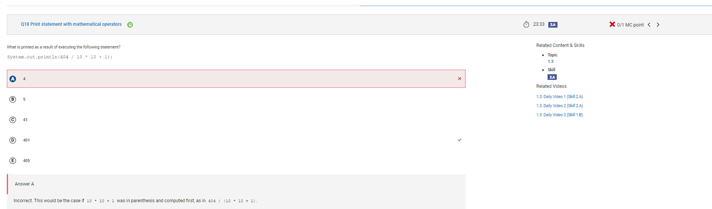
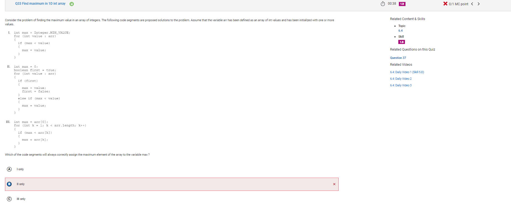
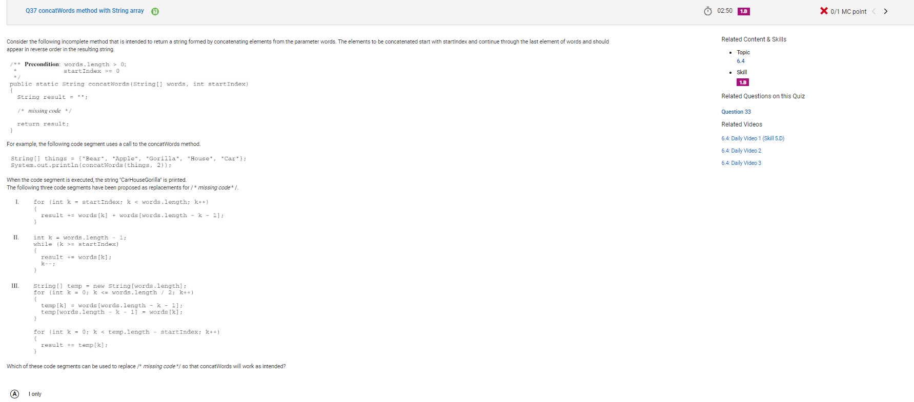

# Overall Score

Scoring 36/39 on my College Board CSA exam allows me to feel confident in my CompSci abilities. However, I recognize an area for improvement in my time management as I spent more time than optimal on certain tasks. This realization underscores the importance of refining my approach to ensure more efficient use of time during future exams. Despite this, I am confident in my computer science essential skills, and I believe with strategic time management adjustments, I can further enhance my overall performance in the future.

# Reflecting on Questions I Got Wrong

## Question 15 Reflection

## Question 17 Reflection

## Question 18 Reflection

## Question 33 Reflection

## Question 37 Reflection

# Reflecting on More Questions

## Question 12

## Question 14

## Question 19

## Question 27

## Question 31

# Final Reflection

