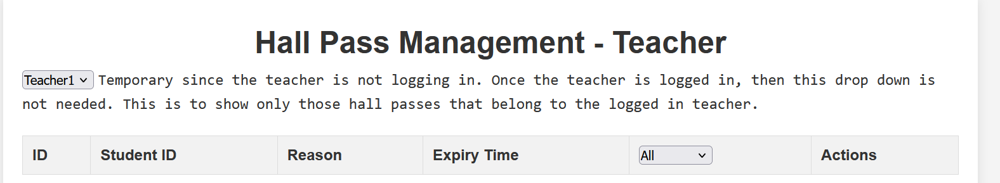

## CSA 

### Important Links
- [Linkedin](https://www.linkedin.com/in/shauryatgoel/)
- [Resume](file:///C:/Users/shaur/Downloads/Shaurya%20Goel-%20%20Resume.pdf)
- [Github Profile](https://github.com/STG-7)

### Projects

### Technologies and Skills:

### SQL:

Usage: SQL is used to interact with the database. In your projects, SQL is utilized to perform CRUD (Create, Read, Update, Delete) operations on the data. The database holds all the necessary information that the backend needs to process and the frontend needs to display.
Example: Storing user information, retrieving data for display on the frontend, and updating records.
SASS:

Usage: SASS (Syntactically Awesome Style Sheets) is a preprocessor scripting language that is interpreted or compiled into CSS. It allows for more dynamic and maintainable stylesheets.
Example: Creating reusable styles, variables, and mixins to maintain a consistent design across the frontend UI.

### HTML5:

Usage: HTML5 is the standard markup language for creating web pages. It structures the content of your web application.
Example: Designing the layout of your web pages, embedding images, videos, and other multimedia, and creating forms for user inputs.

### CSS:

Usage: CSS (Cascading Style Sheets) is used to style the HTML elements on your web pages. It ensures that your application has an appealing and responsive design.
Example: Styling buttons, headers, footers, and making the UI responsive to different screen sizes.
Flask:

Usage: Flask is a micro web framework for Python. It is used to build the backend of your web application.
Example: Setting up routes, handling requests and responses, integrating with the database using SQLAlchemy, and managing the overall server-side logic.

### Jinja:

Usage: Jinja is a templating engine for Python, used with Flask to generate HTML dynamically.
Example: Rendering HTML templates by injecting data from the backend, creating dynamic content such as user-specific pages.

### Python:

Usage: Python is the primary programming language used for backend development in Flask, as well as for writing scripts and implementing the business logic of your application.
Example: Writing algorithms, managing database interactions, handling user authentication, and processing data.

### JavaScript:

Usage: JavaScript is used to make your web application interactive and to handle client-side logic.
Example: Implementing form validation, making asynchronous requests to the server using AJAX, and dynamically updating the DOM without refreshing the page.

### Java:

Usage: Java can be used for developing backend services, particularly in larger enterprise applications or when you need a more robust, scalable solution.
Example: Developing microservices, handling complex backend processing, or building an entire backend system if not using Flask/Python.
Technical Leadership:

Usage: This involves guiding the technical direction of the project, making architectural decisions, and ensuring that the best practices are followed.
Example: Deciding on the technology stack, overseeing code reviews, and ensuring the scalability and maintainability of the codebase.

